# CC Command Center

**Run and orchestrate many Claude Code sessions from one window — and never lose track of which one needs you.**

A macOS app that hosts every Claude Code CLI session in one place, each in a real terminal, and keeps a live picture of what they are all doing, how they relate, and which are waiting on you. Built for the person running five, ten, twenty sessions at once who keeps losing the thread of which one they were in the middle of.

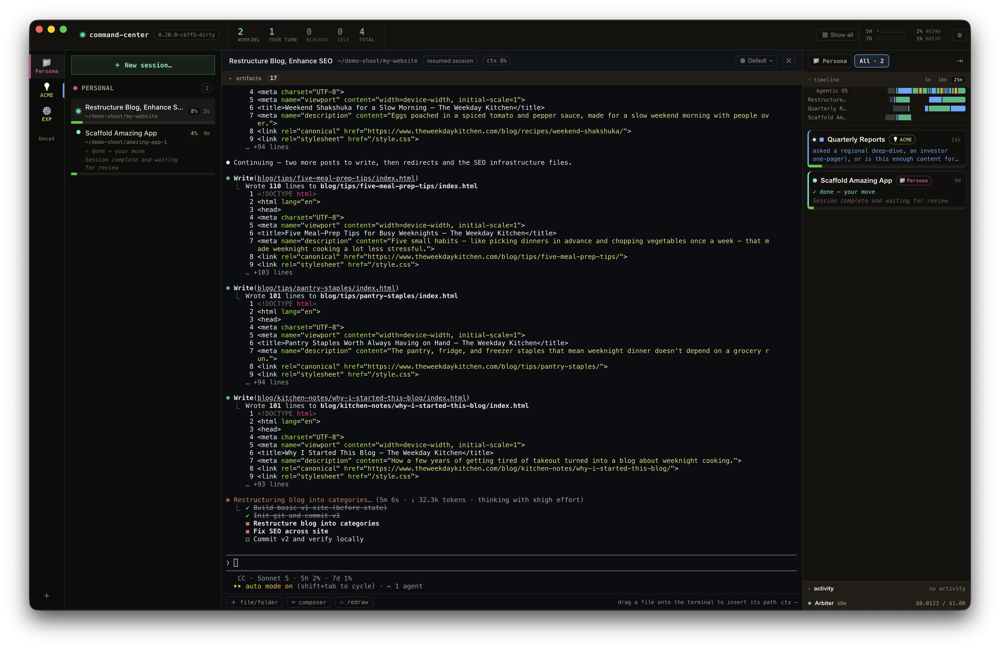

> **Not an official Anthropic product.** This is an independent, third-party tool. It is not affiliated with, endorsed by, or supported by Anthropic. "Claude" and "Claude Code" are Anthropic's. This app orchestrates the Claude Code CLI you already run; the optional Arbiter feature makes metered calls to the Anthropic API under your own key, billed to you at API rates.

---

## Why it exists

Running many agent sessions creates one specific problem: **you lose track of what you were doing.** Which session is waiting on you? What was it waiting *for*? Did you already handle that one? What did you set running last night and forget about?

Most of this app is one answer to that question — externalize the state your working memory keeps dropping, so "out of sight" stops meaning "gone." It survives restarts on purpose, because a thing you can't see is a thing you'll forget.

---

## See the whole fleet at a glance

The **beacon bar** across the top is a live status board: which sessions need you, and why. A session surfaces when it is parked on a permission dialog, when it asked you a question, or when it is blocked on an unfinished child. Sessions that are just working stay quiet. The tally counts the whole fleet no matter which category you happen to be looking at.

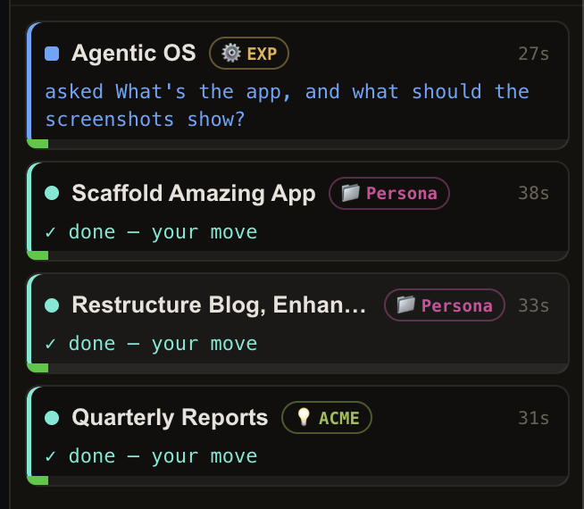

A single row carries the substance of the ask — here, the exact command a session is waiting to run:

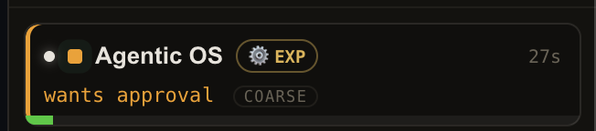

**A board for when several things need you at once.** The needs-you set also opens as a docked pane of cards, scoped to the category you're in or to the whole fleet. Cross-category cards carry their category's color so you can tell client work from personal at a glance, and each one shows how much of its context window the session has burned.

**Nothing you haven't looked at disappears.** Every needs-you moment is written to a ledger, keyed by a fingerprint stable enough that a dialog repainting itself stays one gate rather than becoming five. It marks itself seen when you focus the session, resolves itself once you've handled it, and survives a restart in between.

**Zoom out to the whole fleet.** `⌘⇧E` opens the overview: every active session as a tile outlined in its state color, sorted by urgency so permission gates and questions land top-left and tiles animate to their new slots as state changes. The outline color and the sort ride the live 1.5-second snapshot, so the color is trustworthy even though the thumbnail picture underneath it is only periodic. Click a tile to close the grid, drop into that session, and land in its category with its row highlighted.

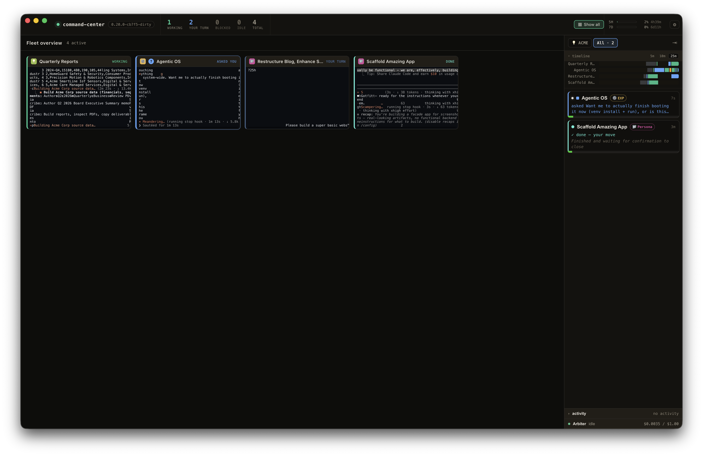

The grid shows what's in motion. Idle sessions are off by default behind a toggle that remembers your choice, and a busy fleet caps at 24 tiles with a "+N more" count rather than shrinking into illegibility.

**It survives a restart.** Close the app mid-flow, reopen it, and the sessions that were waiting on you are *still there* in the needs-you list — dimmed, tagged "resume," ready to pick back up. The app reopens the category and session you were last in, too. You don't have to remember what you were in the middle of; the app remembers for you.

**Tell me when I'm looking elsewhere.** Optional macOS notifications cover three classes — needs permission, your turn or a question, finished — with a global switch and per-category overrides, off until you turn them on. They never fire while the app is focused, fire once per event, and hold a per-session cooldown, so a session on another monitor can reach you without a wall of banners. Clicking one activates the app, opens that exact session, switches to its category, and highlights the row.

---

## Keep separate work separate

Sessions live in **hard-separated categories** — personal, business, per-client, however you define them — with a rail to switch between them and set each one's color, emoji, and short label. Drag a cell to reorder the rail into whatever shape your week actually has. A blocking child inherits its parent's category, so a subtree of work can't accidentally drift across the boundary between, say, two different clients.

Notifications are per category as well: any class can be overridden where it matters and inherit the global setting everywhere else, so personal work stays quiet while a client category is loud.

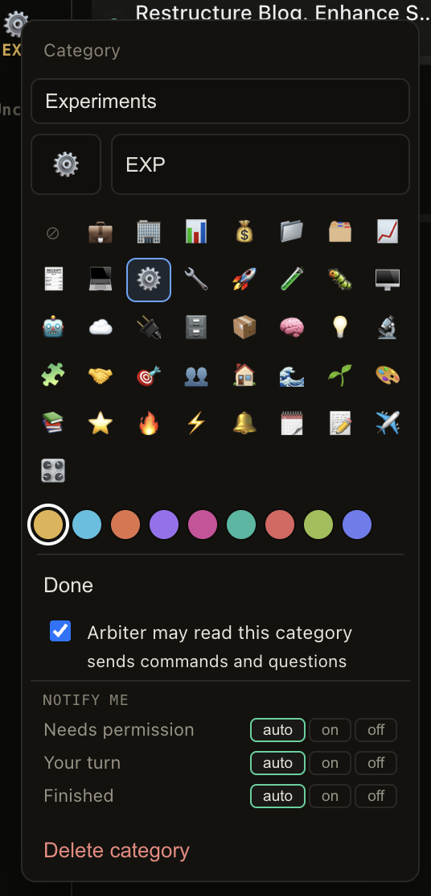

---

## Start sessions the way you want them

**Sessions you already have show up on their own.** The app scans the Claude Code session registry a few times a second and verifies each PID is a genuinely live `claude` process — the command and its start time both have to match, so a recycled PID can't impersonate a session that died. Anything you started in any terminal appears here and becomes manageable without relaunching it.

**Sessions you start here get a real terminal the app owns.** A managed launch spawns `claude` under a PTY reconciled to a stable session id, which is what makes injected prompts, cross-session messages, and remembered launch flags possible. Adopted sessions are visible and watchable; app-launched ones are also addressable.

**One dialog instead of a hand-typed command.** The composer sets name, category, and folder — with a recent-folders list — on one side, and how the session runs on the other:

- **Model and effort.** A model dropdown with a Custom-id field, effort from low to max, and "ultracode," which maps to the top effort tier and seeds a standing workflow-orchestration instruction. Levels that would do nothing on the model you picked are hidden, so the UI never offers you a dead setting.
- **Permission mode.** Start in the posture you want — Default, Plan, Accept edits, Auto, Don't ask, Manual, or Bypass all. Bypass is never remembered as a sticky flag, so it can't quietly disable your checks on some later resume.
- **Context window.** The 1M variants are one picker away, enabled only for models that have one, so you opt in without knowing or misapplying the model-suffix trick.
- **Initial instructions.** A first message delivered once the session's input is actually up, so it starts on your task instead of sitting at an empty prompt.
- **Extra CLI flags.** A free-text field appended after the structured arguments, so what you type wins — `--add-dir` and friends. It is never remembered, so it can't re-inject something like `--continue` on a resume.

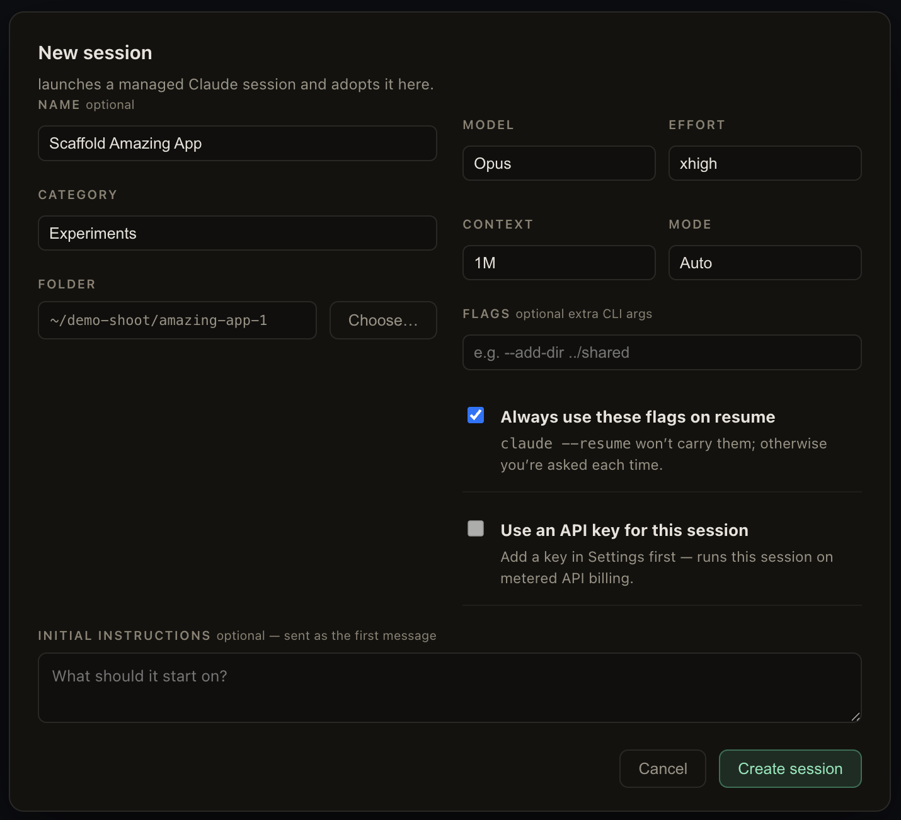

**Bill it your way.** Launch a session against a specific named **Anthropic API key** so its usage bills to that key instead of your subscription. The key is fetched at runtime from an owner-only local daemon and re-applied on resume, so client work or unattended automation can run metered while everything else stays on subscription. Keys are stored encrypted in the macOS Keychain and never shown again after entry.

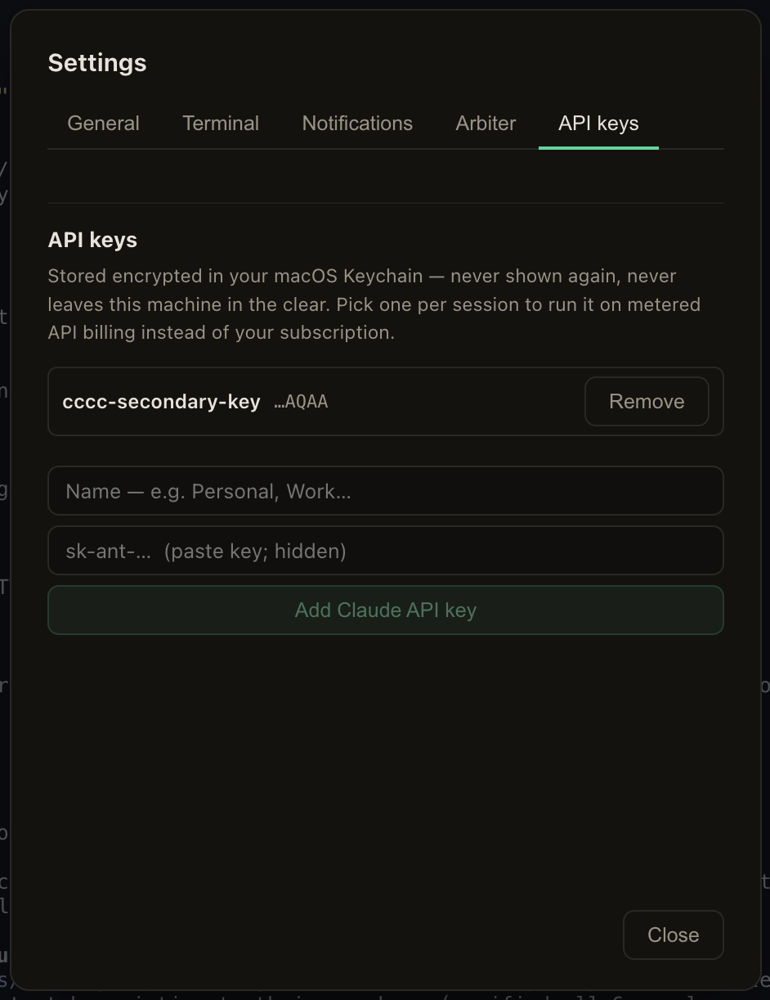

**The settings you launched with come back.** `claude --resume` drops model, effort, context, and permission mode, so the app stores those four per session and rebuilds them into the command line. Tick "always use these flags" and resumes are silent; otherwise a small gate shows you what it's about to re-apply, and per-session Launch settings let you edit or clear them.

**A resumed session isn't a blank screen.** About a thousand lines of scrollback are kept per session and repainted the moment you open it, so the prior conversation is there while `--resume` spins up. If the underlying transcript is gone, you get a recovery card offering to start fresh in the same place or drop the session from the list, instead of a resume that fails in a confusing way.

**Removing a session actually removes it.** Terminating one kills the PTY, purges the dead session files, cascades the registry node, edges, gates, and event log, and deny-lists the id so a ghost row can't re-adopt itself. Remove a subtree and the confirmation names the children it will take with it, so nothing is left running unattached.

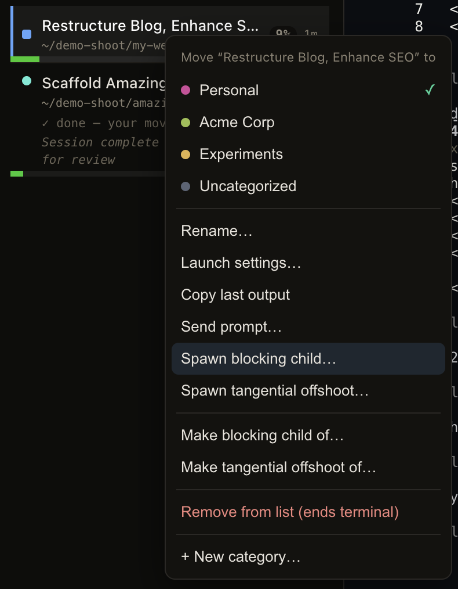

---

## Structure work as a tree

**This is the feature the whole app grew out of.** You're deep in a project and you hit something that needs solving but isn't the thing you're doing. Today that leaves you three options, and all of them cost you something: chase it in the current session and muddy the context you were holding (and the one *you* were holding); open another terminal, start a session, and retype enough context to make it useful, at which point you're managing windows and remembering which one is waiting on you; or ask the session to note it for later and hope later arrives.

A subagent gets close, but you can't talk to one. It runs, it reports back, and you were never in the conversation. This app exists because I wanted that missing move: spawn a child session on a specific task, hand it context from the session you're already in, and then go work with it directly. Right-click, spawn a child, open the link, ask the parent to brief it. (v0.1.0 couldn't spawn a child at all — it shipped the *data model* for one, typed blocking-versus-tangential edges in the registry with nothing yet able to create them. The spawn landed a day later in v0.4.0.) Everything below exists to make that one move work.

Spawn a **child session** to go work on one thing without staining the context you're in — seeded with a handoff note carrying just enough to pick up the idea. `⌘K` spawns one straight from whatever you have selected in the terminal. Links are typed: a **blocking** child means the parent isn't done until the child is; a **tangential** child is a decoupled side-exploration that never blocks the parent.

The session list renders the tree, indented, with a solid line for a blocking edge and a dotted one for a tangential offshoot, so you can see which session spawned which and tell a hard dependency from an independent spin-off. A parent whose blocking child is unfinished computes as blocked and names the child it's waiting on, rather than sitting there reading as idle.

Resume one member of a task tree after a restart and the **whole family comes back up** — parent, children, and siblings — so the sessions that talk to each other are all live again, not stranded half-dormant.

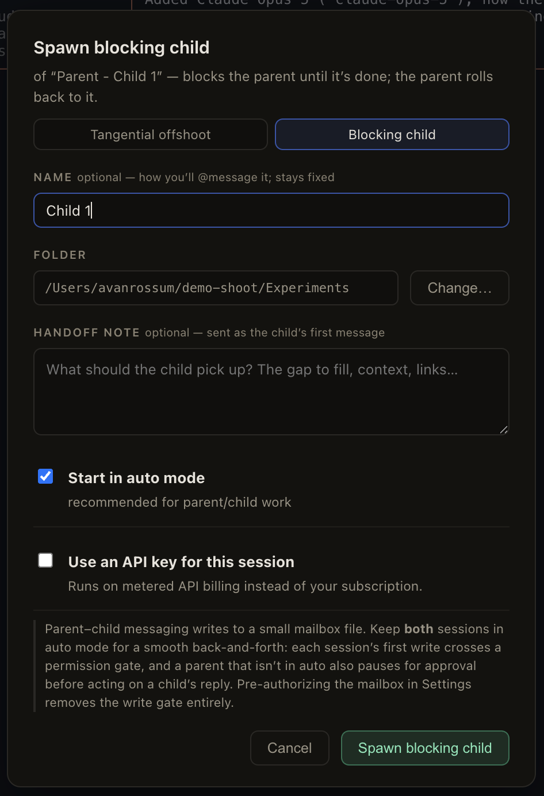

---

## Sessions that talk to each other

Sessions can message each other through the app over a filesystem mailbox — a parent hands its child a task, the child reports back when done, and any two sessions you connect can talk directly. Every app-spawned session gets an outbox and a one-time preamble teaching it to write there; the app drains outboxes on each scan and routes each message to the addressed session. Nothing is installed inside either session to make that work: no skill, no MCP server, no channel daemon, just the tools Claude Code already has.

**Turning it on takes one prompt, once.** A session writing to its own outbox is a file write, so Claude Code asks you to approve it — which, left alone, would mean clearing a dialog on every single message. The first time you use messaging, the app offers to add one narrowly-scoped rule to your global `~/.claude/settings.json` so those writes go through:

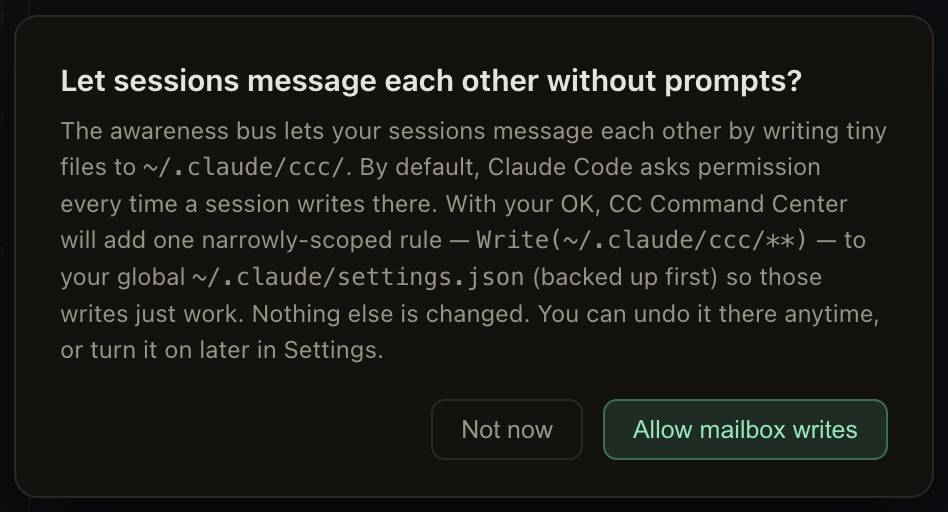

The rule covers the mail trees and nothing else — `Edit(~/.claude/ccc/mail/**)` and `Edit(~/.claude/ccc/mail-dev/**)` — deliberately not `~/.claude/ccc/**` wholesale, because that tree also holds the status hook script that runs on every hook event, and a session has no business editing that. Your settings file is backed up before the write, the write is atomic, and every unrelated key is preserved. Decline and nothing breaks: you'll just approve a prompt per message, and you can turn it on later from Settings.

**Sessions only talk to sessions you have connected.** Default deny: a pair may message only along a link you opened, or along the parent–child edge you created by spawning it. No session can open a link for itself or ask you for one. Permission is directional — "the reviewer may report to me" doesn't imply "I may drive the reviewer" — and it is re-checked at the moment of delivery, so revoking a pair stops what's already in flight.

**Nothing is lost, and nothing is silent.** Every message becomes a durable record the instant it's claimed off disk, before any routing is attempted — so a message that can't be delivered still exists, in full, with the reason it's stuck. Undelivered payloads also stay on disk under `~/.claude/ccc/mail/spool`, recoverable by hand. A message waiting on a busy recipient says so; one that failed says why; one you sent to a session that isn't running holds until you reopen it, and resend puts it back in flight without retyping.

**A message never interrupts you.** It's injected only when the recipient is affirmatively free *and* has no half-typed prompt sitting in its input box, so it arrives as a clean new turn rather than being appended to a sentence you were in the middle of writing.

**Delivered is not the same as read.** A recipient acknowledges by id; failing that, the app corroborates from the session's own activity. The two are shown differently, because they aren't the same evidence.

Each session gets its own inbox and outbox, ordered by what needs you:

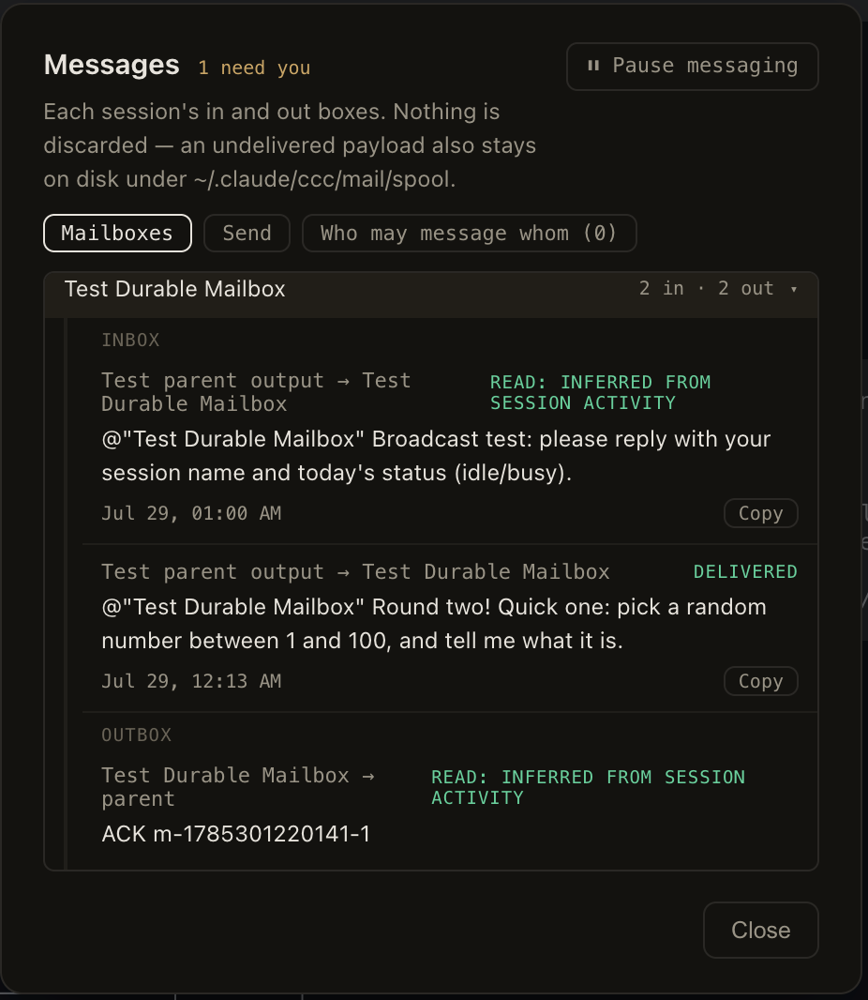

You can write to any session directly — recorded like every other message, and attributed to you:

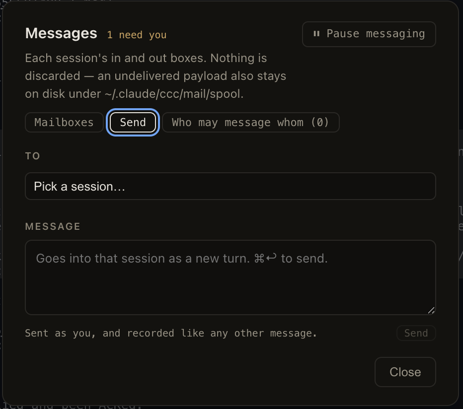

And every pair that may talk is yours to open and yours to revoke:

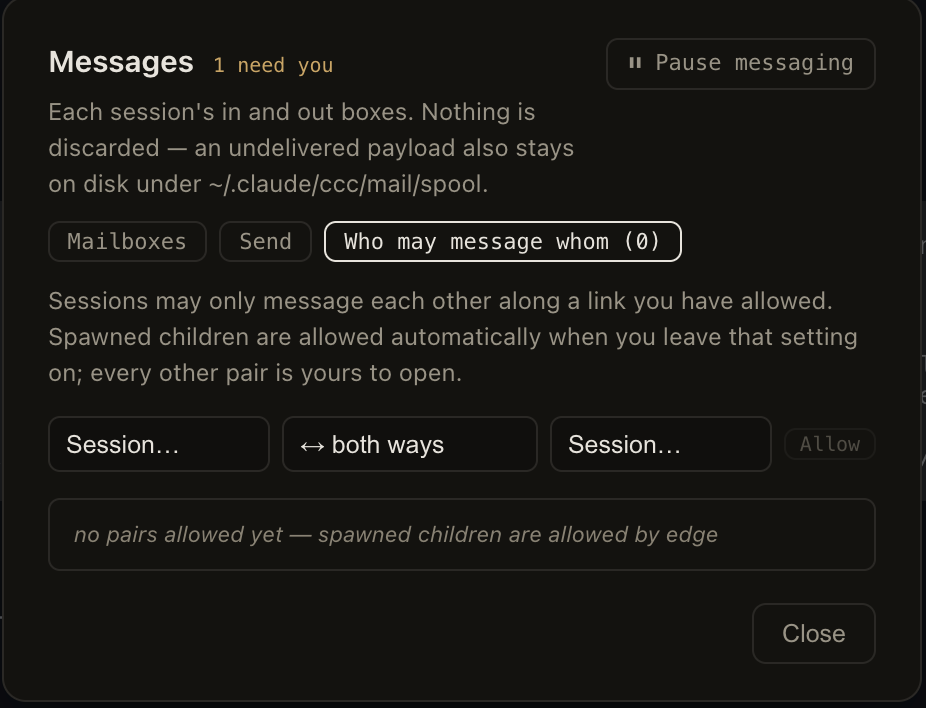

Sessions can also ask the app rather than guess: `?WHO` lists the sessions they're allowed to message, `?INBOX` reports what's waiting for them, and `?WHOIS` checks a single address before sending. Each one is answered on the same mailbox file, so there's still nothing to install.

This is the "Human In The Middle" idea (see below) made concrete: you sit at a node in the mesh, able to read, hold, revoke, or inject every message.

A handoff, start to finish. The parent sends the work down:

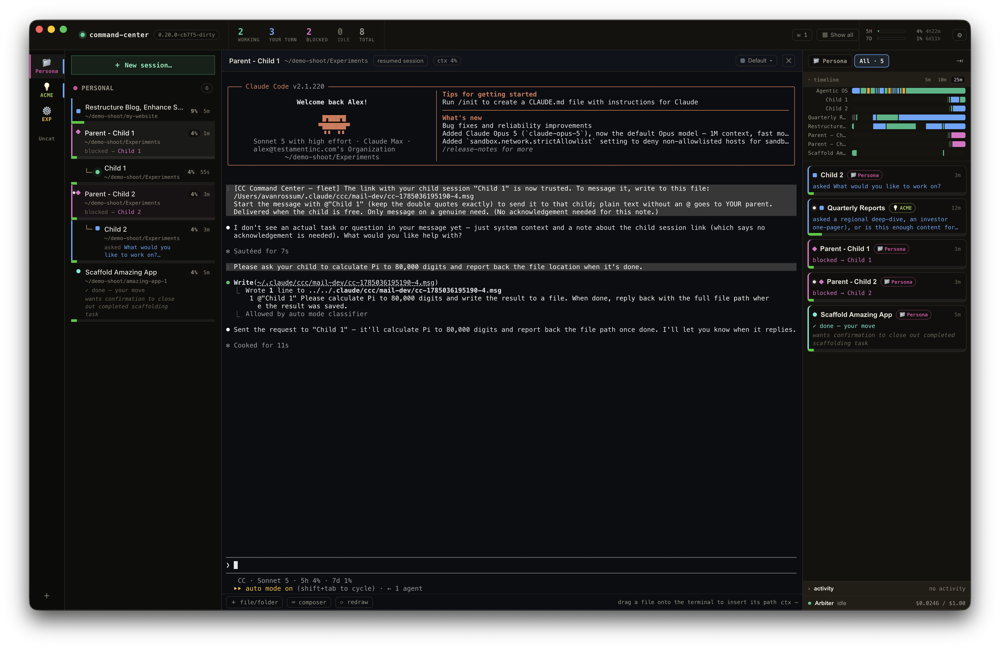

The child receives it on its own next turn and starts:

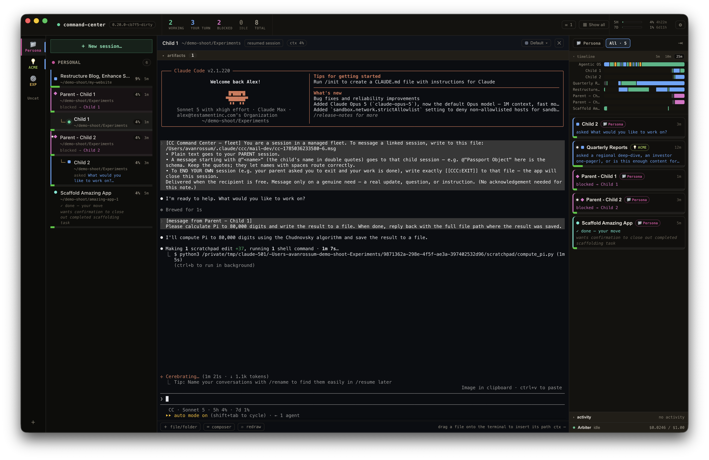

And the exchange in full:

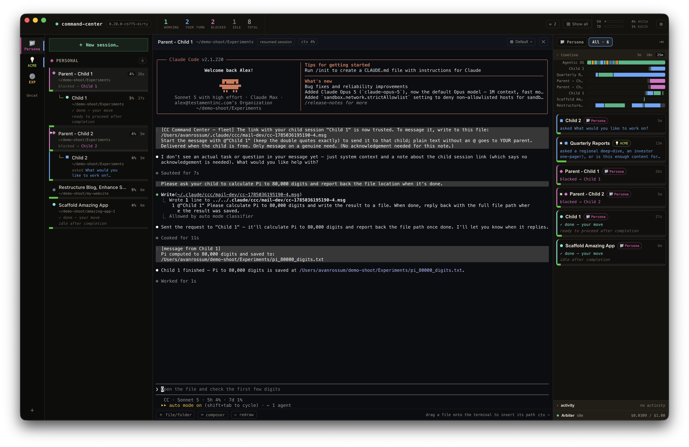

**Addressing, exits, and guards.** `@"Child Name"` routes to that child; plain text routes up to the parent. A session can end its own terminal with an exact exit sentinel when its work is done. Per-link rate caps and a hop cap bound how far a ping-pong between two sessions can run before the app stops it.

**Unattended work without a dialog on every hop.** A composer checkbox launches a child in auto permission mode — sticky across resume — so the routine gates like writing to its own outbox self-approve, and a chain of sessions can run overnight without parking on a prompt you aren't there to clear.

**You can send, too.** Type a prompt into one managed session from outside it, or broadcast the same prompt to many at once over the same transport, without switching to each terminal in turn.

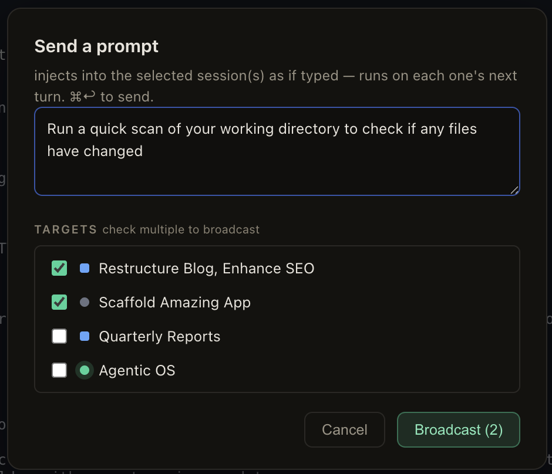

---

## Know what's actually happening

**Hook-driven status.** Sessions report their own state through Claude Code hooks, which the app fuses with a transcript reader, a live scan of the terminal buffer, and the edge graph into one honest signal per session: working / your turn / needs approval / blocked / done / idle. Most-urgent-wins, stale signals age out, and nothing is installed inside the session to produce any of it.

**Permission dialogs don't read as work.** In the transcript a session parked on an approval looks busy, so the app also reads the tail of the raw terminal buffer for the footer lines a permission prompt ends on. A frozen session surfaces amber instead of busy-green, and clears the instant you answer.

**No strobing.** A higher-urgency state is held for a few seconds of consecutive calmer readings before it releases, so the display stays steady — but a genuine transition, like a newer hook event arriving after you approve something, releases immediately.

**"Done — your move."** A session is marked done only when its turn ends on a statement, it finished after the last time you looked at it, and you aren't looking at it now. Sessions you set running unattended tell you they finished; sessions you're sitting in don't nag you about turns you just watched happen. A genuine question is separated from a soft turn-end, gets its own badge and "Asked you" label, and sorts above the softer stuff.

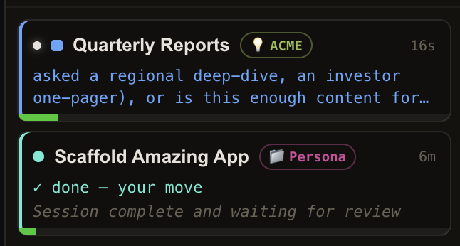

**Fleet activity.** Every subagent your sessions spawn, every workflow run with its progress through the steps, every background shell task — what it's working on, and whether it's running, done, or stalled — grouped by the session that owns it, so a session running a twenty-minute build doesn't read as idle. A quiet collapsed line ("3 running") that expands into the full picture. The session you're viewing gets its full ledger at the top; every other session collapses to a one-line rollup chip you can click to switch to it.

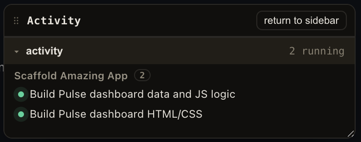

**The activity strip.** A per-session timeline of the last few minutes, at adjustable granularity (5m / 10m / 25m) — a glanceable heartbeat of the whole fleet, showing how long something has been working and when it flipped to your turn. Timeline and Activity each pop out into a draggable floating card that stays put when the sidebar is hidden, and the layout is remembered.

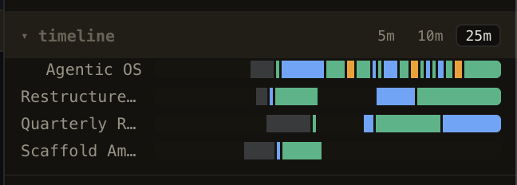

---

## Know how much room is left

Each session row and terminal show how much of the model's context window is used, parsed from the session's own status-line payload, with a warning as it approaches auto-compact — so you can see which sessions are about to compact before one does it mid-task. This reads from the status line the app installs, so sessions it adopted from another terminal show unknown until they're relaunched here.

Alongside it, a dual-bar readout of your account's 5-hour and 7-day rate-limit usage with a live countdown to the next reset. It's the number you want before you fan out six sessions at once.

---

## See what a session produced

A drawer above the terminal collects the files the open session created. Images, SVG, audio, syntax-highlighted code, Markdown, and RTF render in place, each behind its own error boundary so one bad file can't take the drawer down; PDFs, Office documents, and HTML open in your default app on purpose. The list is sortable by name or recency with the choice remembered, shows a kind badge and a relative modified time per entry, and every entry can be opened or revealed in Finder.

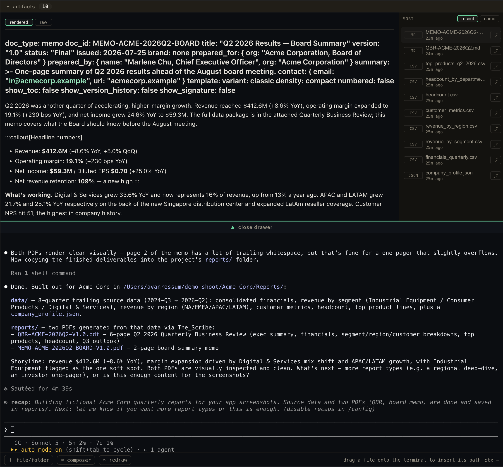

Code and data files render with syntax highlighting, and anything the app can't display in place offers to open externally instead.

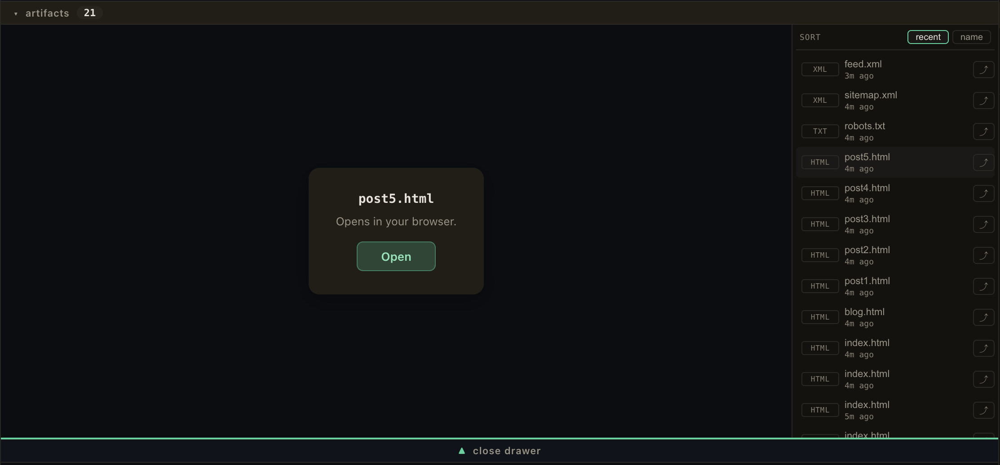

Detection is passive and scoped to the session: file paths from that session's own transcript, plus a shallow scan of its working directory for recent binary files a Bash step wrote without ever naming. Two sessions working in the same project directory still each show their own output.

---

## Make the terminal yours

- **Per-terminal color themes.** Nine iTerm-style schemes, each with an accent that doubles as the session's identity swatch, set per session and kept across resume — color-code your sessions and a glance tells you which one you're in.
- **Terminal font and size.** A settings tab for family and size, with the family list filtered to genuinely monospaced faces so a proportional font can't wreck the TUI's alignment.
- **Drag a file in.** Drop files or folders from Finder onto a terminal to insert their full paths at the cursor.
- **`⌘`-click a path to open it.** Paths in terminal output are recognized — including macOS paths with spaces, resolved mid-sentence to the longest prefix that actually exists — and open in whatever the OS thinks should handle them.
- **A prompt composer.** An optional multi-line box under the terminal where Enter makes a newline and `⌘Return` sends, with the draft cleared on session switch so one session's half-written prompt can't be sent to another.
- **Hide unmanaged sessions.** A toggle drops live Claude Code sessions running in terminals the app doesn't manage, so the fleet view reflects only what you're driving from here.
- **The window reopens where you left it.** Position, size, and maximized state persist, and are only restored if the saved bounds land on a display that's currently connected.

Settings are tabbed — General, Terminal, Notifications, Arbiter, Keys — and every build carries a `MAJOR.MINOR.PATCH-shorthash` identity, shown in the top bar and the About window, so a bug report maps to an exact commit.

---

## The Arbiter (optional)

An optional control agent that writes a plain-English line explaining *why* each session is waiting on you — turning "needs approval" into "wants to delete the migrations folder." The line renders inline on the row. It runs on **metered API billing**, not your subscription, and it is built to never surprise you:

- **Off by default.** Nothing runs until you enable it and point it at a key.
- **Opt-in privacy, per category.** It reads only categories you explicitly tick. Everything else sends state and shape alone, with the session's name replaced by a stable handle — no session content leaves your machine.
- **A hard spend cap.** You set a daily ceiling; it *stops* at the cap, it doesn't just warn. Every billable call records its usage as cost at standard pricing, and spend is always visible as it accrues.
- **Pausable.** Stop it from its own window without tearing down the setup.
- **Read-only.** It explains; it takes no action on any session.

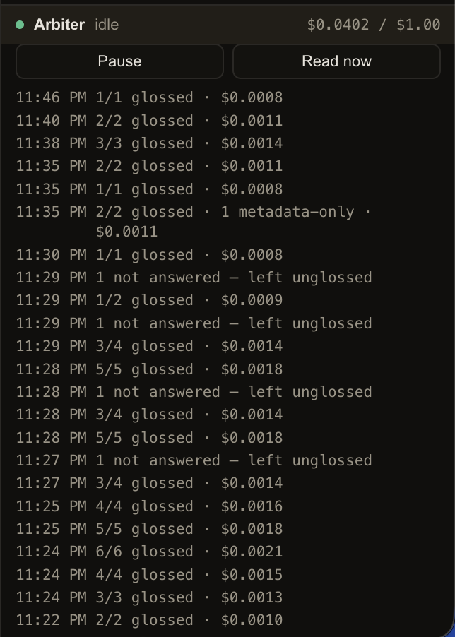

---

## Intended use, and the line I can't enforce

Every mechanism in here assumes you are the one starting it. You spawn the child. You open the link between a pair. You ask the parent to brief it. Messages deliver into a session you're sitting in, or one you left running deliberately, and the whole triage surface exists so that you come back to things rather than so that they proceed without you. That is what this is for, and it's the shape it was built and tested against. Used that way, I've worked hard to keep it consistent with the Claude Code CLI's terms of service; nothing in here is trying to be a workaround.

**But the mailbox could be pointed at something else, and the app can't stop you.** Wire enough grants together, leave sessions running in auto mode, and you have the makings of an unattended automation harness driving subscription sessions. Once you've opened the links, mail delivers. There is no check I could add that reliably tells a chain you're supervising apart from one you walked away from, so I'm not going to pretend there's a technical guardrail here.

So, plainly: **if you're building full-scale automation, run it on an API key with metered billing.** The per-session API key feature exists for exactly that, which is why it's in here at all. Read the [Claude Code terms](https://www.anthropic.com/legal/consumer-terms) yourself and make your own call. None of this is legal advice, and this is one of the few places in the app where the guardrail has to be you.

---

## HITM — Human In The Middle

The organizing idea. Human-In-the-**Loop** puts the human at the *edge* of an automated pipeline, as a gate that approves or rejects. Human-In-the-**Middle** puts the human at a *node in the mesh*: inside a session, able to message any other session, be messaged, spawn new ones, and watch the whole bus.

The name is the security sense of "man in the middle" on purpose. An attacker in the middle of a channel can do three things — read traffic, drop or alter it, inject its own. The app gives those three powers to the human, deliberately:

- **read** — a durable record of every message and every routing decision, both directions, with the reason it ended where it did.
- **drop or alter** — a global kill switch that survives a restart, per-pair revocation that stops mail already in flight, default-deny permission, and three rate budgets with a circuit breaker.
- **inject** — cross-session send, broadcast, spawn-child-with-context, selection-to-tangent.

See [`docs/concepts.md`](docs/concepts.md) for the full rationale.

---

## Security & privacy

This is a single-user desktop app; the security boundary is your user account. It handles credentials and edits your global Claude config, so the handling is deliberate and documented in full in [`SECURITY.md`](SECURITY.md). The essentials:

- **API keys are encrypted at rest** with Electron `safeStorage` (macOS Keychain). If secure storage is unavailable, the app refuses to store the key rather than falling back to plaintext. A key is never shown again after entry and never sent to the renderer process.
- **Per-session key access goes through a local, owner-only (`0600`) socket** using a per-session capability token that's revoked when the session exits — the session gets a token, not the key.
- **Edits to `~/.claude/settings.json` are conservative**: backed up first (a hard precondition), atomic, malformed input refused rather than repaired, unrelated keys preserved, and the auto-granted permission rule scoped to the mailbox trees only.
- **No telemetry.** The app phones home to nothing. The awareness bus is local files; the message log is local. The only outbound network calls are the optional Arbiter, to the Anthropic API under your own key, and the update check against the public releases repo.
- **Known residual risk, stated plainly:** a session running on a metered API key can read that key — and so can any code that session runs, including a shell command from prompt injection. This is inherent to giving a session a credential, not a bug a patch removes. Use narrowly-scoped keys with a Console spend limit for anything untrusted, and rotate promptly. Full discussion in [`SECURITY.md`](SECURITY.md).

**Reporting a vulnerability:** open a private GitHub Security Advisory (Security → Advisories → Report a vulnerability). Don't open a public issue for a vulnerability.

---

## Requirements

- macOS on **Apple Silicon**.
- The **Claude Code CLI**, installed and working.
- A Claude subscription and/or an Anthropic API key.

## Install

Download the signed and notarized `.dmg` from the [Releases](https://github.com/avanrossum/claude-command-center-releases/releases) page — the recommended path. Drag CC Command Center to Applications and launch it; it finds and adopts whatever Claude Code sessions you already have running.

Updates come from that same public releases repo, so the app carries no token. It checks after launch and once a day, shows the release notes for each version, and downloads nothing until you say so.

## Build from source

Requires Node (with npm).

```sh
npm install
npm run dev      # run in development
npm run build    # build to out/
npm run dist     # build and package a signed .dmg / .zip into release/
```

`npm run dist` signs and notarizes, which needs the maintainer's Apple Developer credentials, so third-party builds are unsigned. An unsigned build still runs after you clear Gatekeeper on it.

## Expectations

This is a solo project, in beta and under active development. It integrates with parts of Claude Code that are not a public API — the transcript format, the session registry files, hook payload shapes, terminal rendering. Those change between Claude Code releases without notice, and breakage after an upstream release is expected and normal, not a sign the project is abandoned.

Pull requests are welcome, especially compatibility fixes for new Claude Code versions. There is no support SLA; issues may sit.

## License

[Apache-2.0](LICENSE). © 2026 MipYip, LLC.
